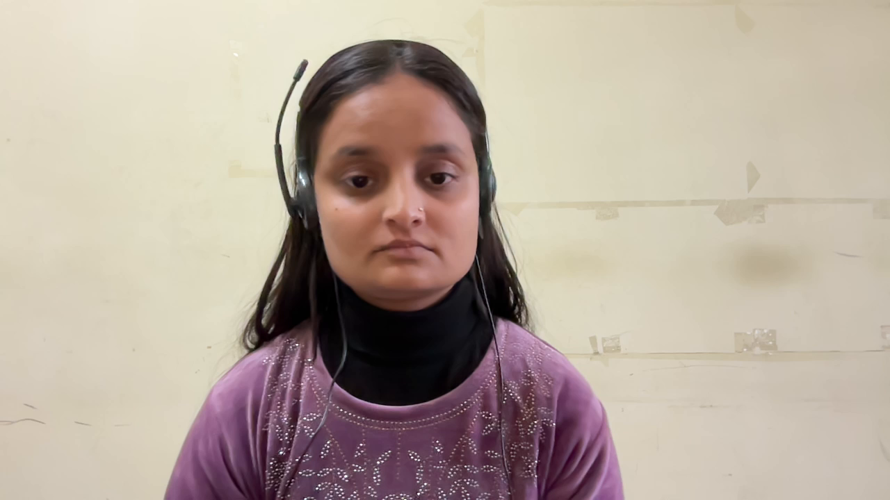
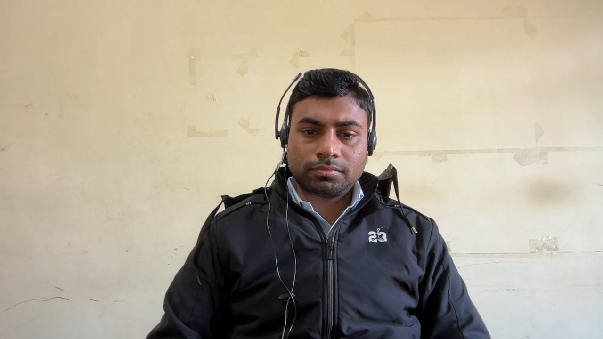
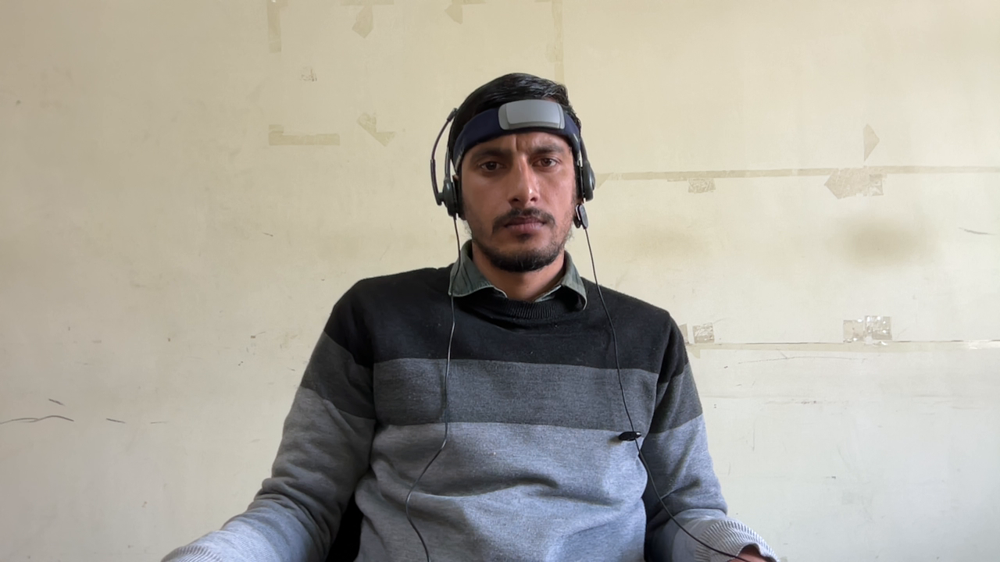
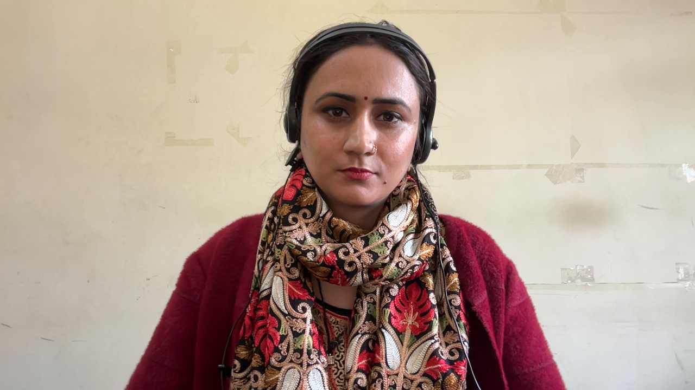

**A New Diverse Dataset for rPPG Estimation, and Benchmarking with Standard Frameworks**

Description

This repository contains the **Diverse rPPG Dataset (DrPPG-25)** — a novel dataset curated to advance research in **remote photoplethysmography (rPPG)** and physiological signal estimation from facial videos.
The dataset comprises **high-resolution facial recordings** under varied conditions including illumination, skin tone, head motion, and emotional expression diversity. Each video sample is synchronized with corresponding **ground-truth RR intervals** acquired via a contact sensor.

Key Features:

* Participants: 46 individuals (balanced gender ratio, diverse age range)
* Resolution: 1080p @ 30 fps
* Duration: ~2 minutes per video
* Modalities: RGB video, contact PPG, metadata (age, gender, skin tone)

The dataset aims to benchmark algorithms for heart rate estimation, pulse waveform reconstruction, and robustness analysis across demographics.

---

Sample Data

Below are examples of available modalities:


<p align="center">
  
  
  
  
</p>

---

Download

The dataset is available for research purposes.
To request access:

1. Email your application to d23229@students.iitmandi.ac.in with the subject line:
   `Dataset Access Request – rPPG-25`
2. Upon approval, you will receive a download link.

> Note: This dataset is intended for non-commercial academic research only.

---

## 📄 Citation

If you use this dataset in your research, please cite:

```
@dataset{navdha2025drppg,
  title     = {A New Diverse Dataset for rPPG Estimation},
  author    = {Navdha Bhardwaj and Arnav Bh
  journal   = {ACM ICVGIP Proceedings},
  url       = {https://github.com/your-repo/drppg-dataset}
}

Acknowledgement
We acknowledge the support of the Visual Computing Lab, Indian Institute of Technology Mandi, and all volunteers who participated in the data collection process.
For this study, the dataset is available for other researchers upon request.
  journal   = {ACM ICVGIP Proceedings},
  url       = {https://github.com/your-repo/drppg-dataset}
}
```
